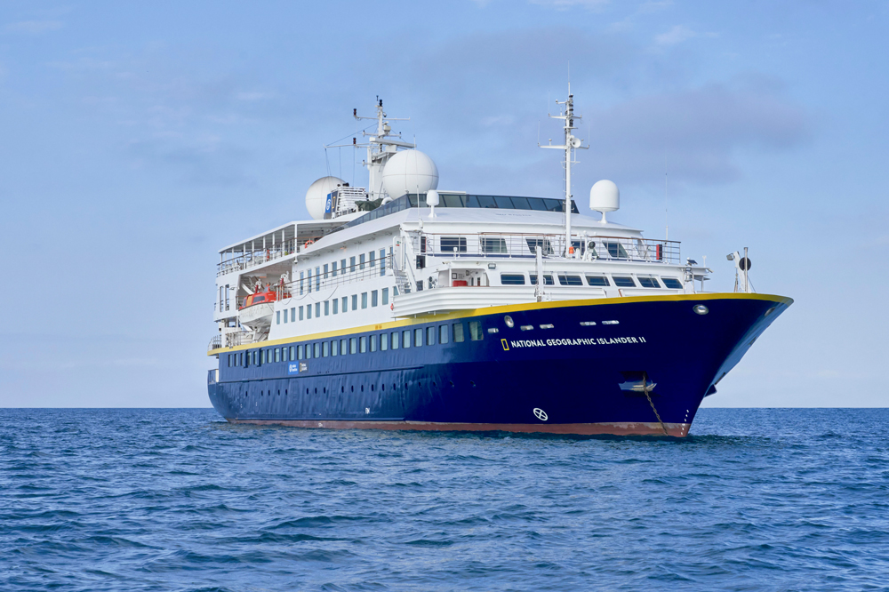
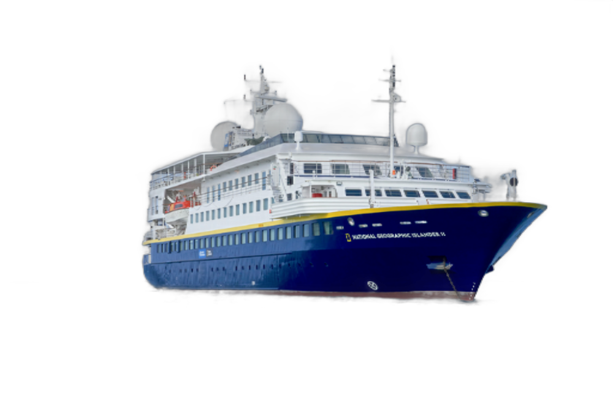
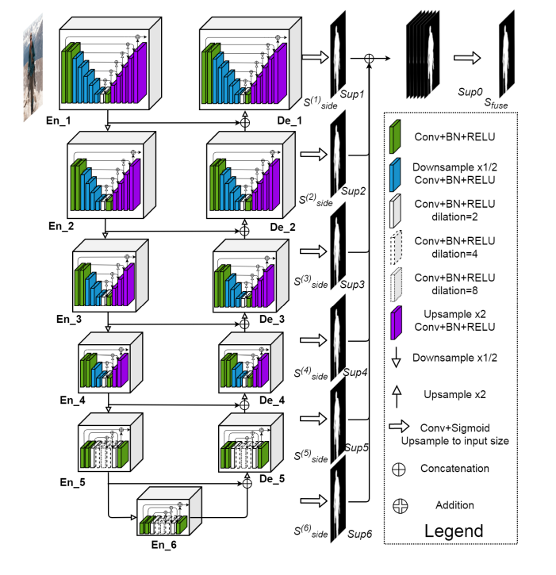

<h2 align="center"> Deep Learning: U2-Net 🧠 </h2>
<p align="center"> Tensorflow/Keras: Image Segmentation Model for Image Background Removal Tasks ✂️ (10/2024)</p>
<p align="center"> 
    <p align="center"> 
    
    
    
    </p>
</p>

<hr>

### Sample Results:
<p align="left">
  
  
</p>
<p align="left">
  
  
</p>

## 🚀 Explore the Model on Hugging Face!
<p align="center">
  <a href="https://huggingface.co/reidn3r/u2net-image-rembg" target="_blank">
    
  </a>
</p>

**Example Code to Load the Model (Google Colab/Kaggle Notebook):**

```python
from huggingface_hub import notebook_login
from huggingface_hub import snapshot_download
import tensorflow as tf
import os

#Realize Autenticação
notebook_login() 

#Carregue o modelo do repositório
repo_id = "reidn3r/u2net-image-rembg"
model_path = snapshot_download(repo_id=repo_id)
keras_model_path = os.path.join(model_path, 'u2net-512.keras')

#Carregue o modelo localmente
model = tf.keras.models.load_model(keras_model_path)

#Exibir a arquitetura do modelo
model.summary()
```

### Dataset:
<p align="left">
  <p align="left">The model was trained on <a target="_blank" href="https://github.com/xuebinqin/DIS.git">DIS dataset</a> (about 5k images)</p>
</p>

<p>


### Details:
<p align="left">
  <p align="left">The model was implemented based on <a href="https://arxiv.org/pdf/2005.09007" target="_blank">this article</a></p>
  <p align="left">The architecture:</p>
  
</p>

<p>

### General Structure
1. **🖼️ Encoder:**
   - The encoder is responsible for extracting features from the input image, capturing **what** information is present in the given image to the model.
   - It uses pooling operations to reduce spatial dimensionality while preserving the extracted information..

2. **📊 Decoder:**
   - The decoder applies UpSampling operations on the tensor of information returned by the encoder to restore the spatial dimensionality.
   - It also uses convolutions combined with information provided by the encoder (through skip connections), locating **where** the information captured by the encoder is. 

3. **📈 RSU Block:**
   - A Residual Block that combines residual connections and concepts from the traditional U-Net architecture to create a block that captures information at multiple resolution scales.

4. **🌉 Bridge Blocks:**
   - Blocks that connect the outputs of the encoder to the decoder. They participate in merging information captured during downsampling in the encoder with fine details (recovered during upsampling in the decoder).
</p>

## Linkedin and Gmail
<p align="center">

[](https://linkedin.com/in/reidner-adnan-b19377210) 	[](mailto:rdn.adn00@gmail.com)

</p>


